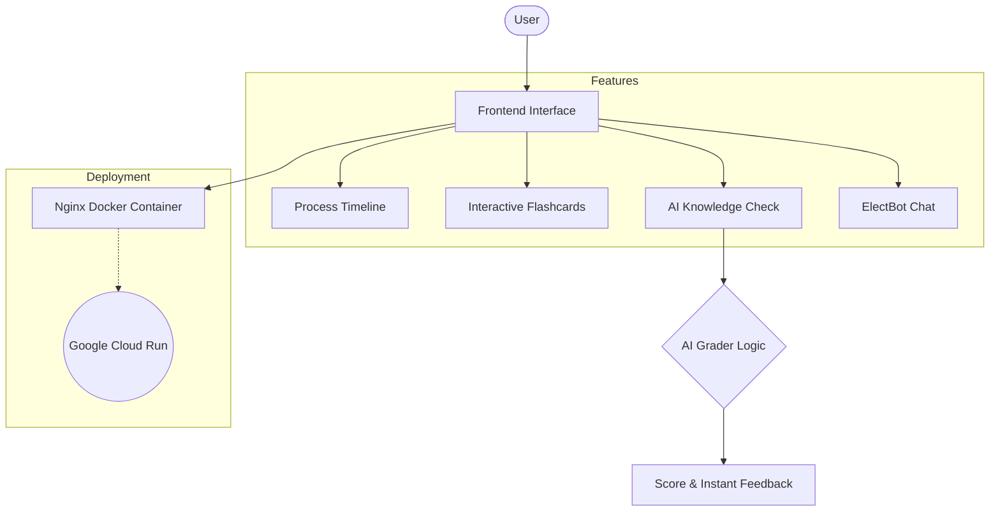

# ElectAssist: Interactive Election Assistant

Welcome to **ElectAssist**, an interactive and engaging web-based application designed to help users understand the democratic election process. 

This application provides a comprehensive guide through timelines, interactive study materials, and AI-simulated assessments, all wrapped in a modern, responsive glassmorphism UI.

## 🌟 Features

*   **Process Timeline**: A step-by-step visual timeline explaining the crucial stages of an election, from voter registration to counting and certification.
*   **Interactive Flashcards**: 3D flipping flashcards to help users learn and memorize key election terminology (e.g., Electoral College, Gerrymandering, Swing State).
*   **AI Knowledge Check**: A built-in assignment/quiz where users test their understanding. An "AI Grader" evaluates the answers and provides constructive feedback based on the final score.
*   **ElectBot Assistant**: An interactive chat interface that answers common questions regarding the election process, voting logistics, and definitions.

## 🏗️ Architecture & Workflow Diagram



## 🚀 Deployment to Google Cloud Run

This project is containerized using Docker and Nginx, making it incredibly lightweight and ready for serverless deployment on Google Cloud Run.

### Prerequisites
*   [Google Cloud SDK (gcloud)](https://cloud.google.com/sdk/docs/install) installed.
*   A Google Cloud Project with Billing enabled.

### Deployment Steps
1. Authenticate your gcloud CLI:
   ```bash
   gcloud auth login
   ```
2. Set your Google Cloud project:
   ```bash
   gcloud config set project trans-sunset-495213-d4
   ```
3. Deploy directly from the source directory:
   ```bash
   gcloud run deploy election-assistant --source . --region us-central1 --allow-unauthenticated
   ```
4. Or, simply run the included `deploy.bat` script on Windows!

## 🛠️ Technology Stack
*   **Frontend**: HTML5, CSS3 (Vanilla, Glassmorphism design), JavaScript
*   **Icons**: FontAwesome 6
*   **Deployment**: Docker, Nginx (Alpine), Google Cloud Run
